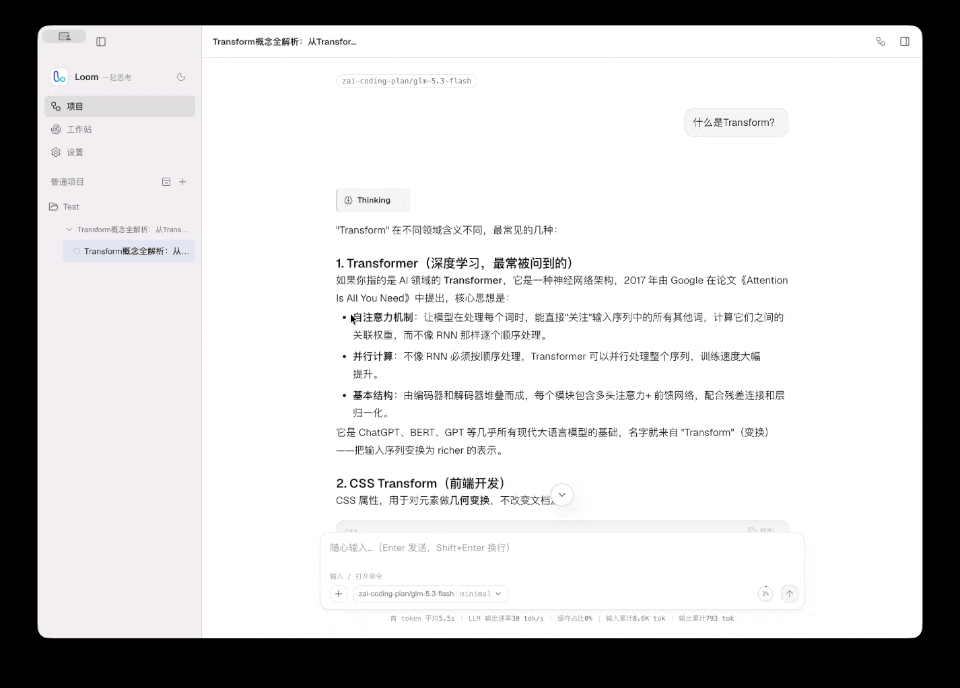
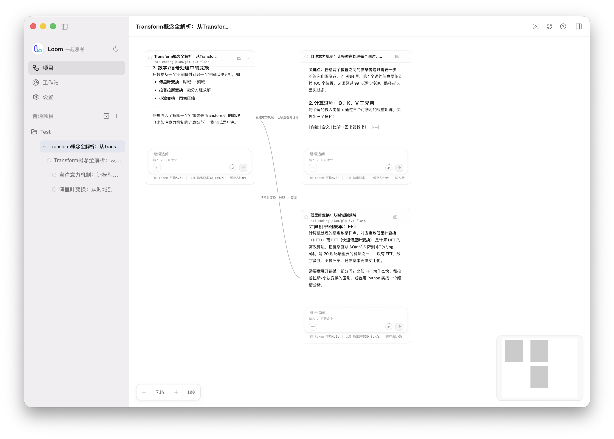

# Loom

[中文](README.zh.md) · [English](README.md)

> 一个把 AI 对话组织成可探索思考空间的本地 Agent 工作台。

Loom 从对话开始，让你把一个问题拆成多个分支，铺展到画布上继续思考；同时提供项目文件、Agent 工具、长期记忆，以及本地 Agent 工作状态观察。

它适合研究、学习、写作、编程，以及任何需要持续思考和反复推演的工作。

<p align="center">
  
</p>

<p align="center">
  
</p>

## 核心功能

### 对话与分支画布

- 支持流式 AI 对话、Markdown 和代码高亮
- 从回复中选中一段内容，直接创建新的分支对话
- 分支保留来源关系，可在聊天视图和画布视图之间切换
- 一个项目可以包含多个会话，每个会话都可以展开成思考图
- 支持重新生成、编辑后重发、继续对话和手动整理画布

### 上下文会话管理

Loom 把“上下文如何进入下一次请求”作为核心能力，而不是把所有历史消息简单拼接起来。

- 分支默认从选中的片段开始，避免无关祖先上下文污染新问题
- 需要连续深挖时，可以手动挂载祖先上下文
- 每个节点显示上下文预算和 token 使用情况
- 长会话通过结构化 checkpoint 压缩，原始 transcript 保留不丢失
- 支持手动 compact、自动 compact 和上下文溢出恢复
- Trace 可以查看上下文投影、预算诊断和 Agent 生命周期

### Agent 工作流

- 支持文件读取、写入、编辑、命令执行、计算和网络请求
- 支持任务计划、工具调用时间线和生成文件
- 支持图片、文件和项目文件引用
- 支持 Skills，并可按分支启用或关闭
- 支持 MCP Server 接入
- 工具调用经过权限和审批控制

### Agent 能力特点

- 工具按需调用，文件、命令、计算、网络和 MCP 能力使用统一的运行时管理
- 工具输出有大小预算和微压缩机制，避免一次过大的结果挤占后续上下文
- 每次 Agent 回合都有清晰的开始、执行、等待、完成、失败和取消状态
- 工具失败、超时或被拒绝时，以结构化结果返回，保留现场并支持继续处理
- Skills 可以从全局或项目目录加载，也可以设置为仅手动调用，减少无关指令进入上下文
- 文件访问经过项目范围、路径和符号链接校验；越界、网络和破坏性操作可以单独请求授权
- Trace 和指标记录模型调用、工具调用、compact 与耗时，便于定位问题和复盘一次运行

### 项目文件工作区

- 按项目组织文件、会话和分支
- 浏览项目目录和搜索文件
- 预览文本、图片和代码文件
- 使用 Monaco 编辑器修改项目文件
- Agent 的文件访问范围绑定到项目目录

### 模型与 Provider

- 在设置中管理 Provider、模型和认证方式
- 支持内置模型目录、Models.dev 模型目录和自定义模型
- 支持不同模型的上下文窗口、推理能力和图片输入能力
- 可为不同分支选择不同模型和推理级别

### 长期记忆与本地 Agent 观察

- 将用户偏好、项目事实和协作反馈保存为 Markdown
- 支持用户级记忆和项目级记忆
- 候选记忆可以先审核，再正式保存
- 观察本地 Claude Code / Codex 的运行、等待和完成状态
- 支持活动流和桌面通知，不接管正在运行的终端会话

## 可靠性基础

Loom 的 Agent 能力由分层的测试与验证 harness 支撑，覆盖上下文图谱、预算计算、compact、工具审批、MCP、持久化、IPC 和渲染交互。

- API key、工具执行和文件访问留在 Electron 主进程
- renderer 只负责视图和事件订阅
- 工具参数采用结构化契约，不通过拼接 shell 字符串执行
- 长上下文的原始消息 append-only 保存
- 权限、越界访问、网络访问和破坏性操作可以单独审批

## 安装与运行

### 直接下载

发布包会放在 GitHub Releases 中：

**[下载最新版本](https://github.com/onenameneo/Loom/releases)**

当前版本为 `v0.1.0` 预览版。当前发布包未进行平台签名，macOS 和 Windows 首次运行时可能显示系统安全提示。

### 从源码运行

```bash
pnpm install
pnpm dev
```

启动后，在「设置」中添加 Provider、模型和认证信息。

常用命令：

```bash
pnpm build       # 构建应用代码
pnpm typecheck   # 严格类型检查
pnpm test        # 运行测试
pnpm dist:mac    # 构建 macOS 安装包
pnpm dist:win    # 构建 Windows 安装包
pnpm dist:linux  # 构建 Linux 安装包
```

本地构建产物位于 `dist/`。正式发布时，推送形如 `v0.1.0` 的 Git tag，GitHub Actions 会自动构建各平台产物并创建 Draft Release。

## 技术栈

Electron · React · TypeScript · React Flow · pi-mono · SQLite · Monaco Editor · MCP

## 项目结构

```text
src/main/       Electron 主进程、Agent runtime、工具、MCP、记忆和持久化
src/preload/    安全的 contextBridge API
src/renderer/   React 界面、对话、画布、工作区和设置
prototype/      画布视觉原型
docs/           专题文档
```

## 相关项目

[Loom Chat](https://github.com/onenameneo/dsh-plugin-loom-chat) 是一个 DSH Web 客户端插件，把线性会话变成可平移、缩放和分支的并行探索画布。它适合在 DSH 中体验 Loom 的分支思考方式，每个分支保留独立的历史、草稿和运行状态。

## 开源状态

Loom 目前处于 `0.1.0` 预览阶段。核心对话、项目会话、分支画布、上下文管理、Agent 工具、MCP、长期记忆和本地 Agent 观察已经接入；界面细节、跨平台分发和更多 Provider 支持仍在持续打磨。
